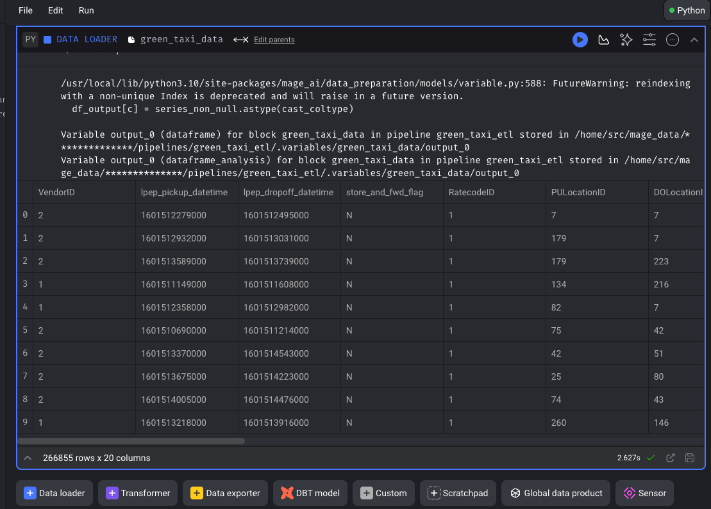

## Week 2 Homework
## Question 1. Data Loading

Once the dataset is loaded, what's the shape of the data?

* **266,855 rows x 20 columns  <- answer** 
* 544,898 rows x 18 columns
* 544,898 rows x 20 columns
* 133,744 rows x 20 columns

<details>
<summary> Picture proof</summary>



</details>


<details><summary>Python Code Using pd.concat Loop</summary>
    
```python
import io
import pandas as pd
import requests
if 'data_loader' not in globals():
    from mage_ai.data_preparation.decorators import data_loader
if 'test' not in globals():
    from mage_ai.data_preparation.decorators import test

@data_loader
def load_data_from_api(*args, **kwargs):
    urls = ['https://github.com/DataTalksClub/nyc-tlc-data/releases/download/green/green_tripdata_2020-10.csv.gz',
        'https://github.com/DataTalksClub/nyc-tlc-data/releases/download/green/green_tripdata_2020-11.csv.gz',
        'https://github.com/DataTalksClub/nyc-tlc-data/releases/download/green/green_tripdata_2020-12.csv.gz']

    taxi_dtypes = {
                    'VendorID': pd.Int64Dtype(),
                    'passenger_count': pd.Int64Dtype(),
                    'trip_distance': float,
                    'RatecodeID':pd.Int64Dtype(),
                    'store_and_fwd_flag':str,
                    'PULocationID':pd.Int64Dtype(),
                    'DOLocationID':pd.Int64Dtype(),
                    'payment_type': pd.Int64Dtype(),
                    'fare_amount': float,
                    'extra':float,
                    'mta_tax':float,
                    'tip_amount':float,
                    'tolls_amount':float,
                    'improvement_surcharge':float,
                    'total_amount':float,
                    'congestion_surcharge':float
                }

    # native date parsing 
    parse_dates = ['lpep_pickup_datetime', 'lpep_dropoff_datetime']

    return pd.concat((pd.read_csv(
        url, sep=',', compression='gzip', dtype=taxi_dtypes, parse_dates=parse_dates) for url in urls))


@test
def test_output(output, *args) -> None:
    """
    Template code for testing the output of the block.
    """
    assert output is not None, 'The output is undefined'
```
</details>

## Question 2. Data Transformation

Upon filtering the dataset where the passenger count is equal to 0 _or_ the trip distance is equal to zero, how many rows are left?

* 544,897 rows
* 266,855 rows
* **139,370 rows <- answer**
* 266,856 rows

<details>
<summary>Python Code</summary>

```python
if 'transformer' not in globals():
    from mage_ai.data_preparation.decorators import transformer
if 'test' not in globals():
    from mage_ai.data_preparation.decorators import test


@transformer
def transform(data, *args, **kwargs):
    print(f"Preprocessing: rows with zero passengers: {data['passenger_count'].isin([0]).sum()}")
    print(f"Preprocessing: rows with trip distance greater than 0: {data['trip_distance'].gt(0).sum()}")

    passenger_mask = data['passenger_count'] > 0
    distance_mask = data['trip_distance'] > 0 

    return data[passenger_mask & distance_mask]


@test
def test_output(output, *args) -> None:
    """
    Template code for testing the output of the block.
    """
    assert output is not None, 'The output is undefined'
```

</details>

## Question 3. Data Transformation

Which of the following creates a new column `lpep_pickup_date` by converting `lpep_pickup_datetime` to a date?

* data = data['lpep_pickup_datetime'].date
* data('lpep_pickup_date') = data['lpep_pickup_datetime'].date
* **data['lpep_pickup_date'] = data['lpep_pickup_datetime'].dt.date <- answer**
* data['lpep_pickup_date'] = data['lpep_pickup_datetime'].dt().date()

<details>
<summary>Python Code</summary>

```commandline
>>> november_csv['lpep_pickup_datetime'] = pd.to_datetime(november_csv['lpep_pickup_datetime']
... )
>>> november_csv.info()
<class 'pandas.core.frame.DataFrame'>
RangeIndex: 88605 entries, 0 to 88604
Data columns (total 20 columns):
 #   Column                 Non-Null Count  Dtype
---  ------                 --------------  -----
 0   VendorID               48491 non-null  float64
 1   lpep_pickup_datetime   88605 non-null  datetime64[ns]
 2   lpep_dropoff_datetime  88605 non-null  object
 3   store_and_fwd_flag     48491 non-null  object
 4   RatecodeID             48491 non-null  float64
 5   PULocationID           88605 non-null  int64
 6   DOLocationID           88605 non-null  int64
 7   passenger_count        48491 non-null  float64
 8   trip_distance          88605 non-null  float64
 9   fare_amount            88605 non-null  float64
 10  extra                  88605 non-null  float64
 11  mta_tax                88605 non-null  float64
 12  tip_amount             88605 non-null  float64
 13  tolls_amount           88605 non-null  float64
 14  ehail_fee              0 non-null      float64
 15  improvement_surcharge  88605 non-null  float64
 16  total_amount           88605 non-null  float64
 17  payment_type           48491 non-null  float64
 18  trip_type              48491 non-null  float64
 19  congestion_surcharge   48491 non-null  float64
dtypes: datetime64[ns](1), float64(15), int64(2), object(2)
memory usage: 13.5+ MB
>>> november_csv['lpep_pickup_date'] = november_csv['lpep_pickup_datetime'].dt.date
>>> november_csv.info()
```
</details>


## Question 4. Data Transformation

What are the existing values of `VendorID` in the dataset?

* 1, 2, or 3
* **1 or 2 <- answer**
* 1, 2, 3, 4
* 1

<details>
<summary>Python Code</summary>

``` commandline
print(f"Preprocessing: vendorid existing values: {data.VendorID.unique()}")

result:
Preprocessing: vendorid existing values: <IntegerArray>
[2, 1, <NA>]
```

</details>


## Question 5. Data Transformation

How many columns need to be renamed to snake case?

* 3
* 6
* 2
* **4 <- answer**


<details>
<summary>Explanation </summary>

```commandline 

Columns:

VendorID - 1 
lpep_pickup_datetime
lpep_dropoff_datetime
store_and_fwd_flag
RatecodeID - 2
PULocationID - 3
DOLocationID - 4
passenger_count
trip_distance
fare_amount
extra
mta_tax
tip_amount
tolls_amount
ehail_fee
improvement_surcharge
total_amount
payment_type
trip_type
congestion_surcharge

```

</details>

## Question 6. Data Exporting

Once exported, how many partitions (folders) are present in Google Cloud?

* **96 <- closest to my answer of 95**
* 56
* 67
* 108

<details>
<summary>Explanation</summary>

When viewing the bucket, view of folders states:
1 – 50 of 95

</details>

## Submitting the solutions

* Form for submitting: https://courses.datatalks.club/de-zoomcamp-2024/homework/hw2

Deadline: February, 5th (Monday), 23:00 CET
