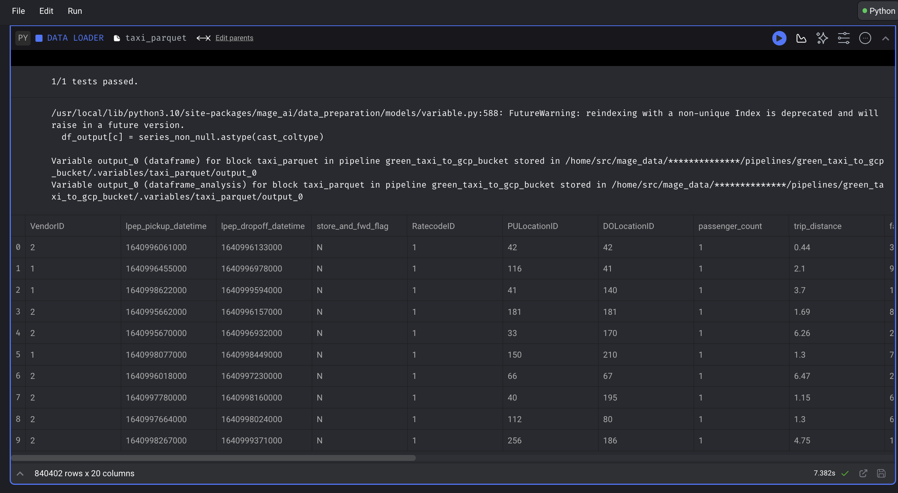

*** Homework Answer Proofs ***

## Setup

```SQL
-- Creating external table referring to gcs path
CREATE OR REPLACE EXTERNAL TABLE `ny_taxi.green_taxi_2022_external`
OPTIONS (
  format = 'parquet',
  uris = ['gs://de_zoomcamp_nyc_greentaxi_2022/greentaxi_2022']
);


-- Create a non partitioned table from external table
CREATE OR REPLACE TABLE ny_taxi.green_taxi_2022_nonpartitioned AS
SELECT * FROM ny_taxi.green_taxi_2022_external;

# timestamp is in string format like 1640996061000000000
# needs to be something like 1640996061
# trim last 9 chars off
SELECT CAST(1640996061000000000 / 1000000000 AS INT);

# this is now an epoch timestamp with second precision, stored as int
# convert to timestamp
# TIMESTAMP_SECONDS(int64_expression)

SELECT TIMESTAMP_SECONDS(1640996061);
# results in 2022-01-01 00:14:21 UTC

# put it together
SELECT TIMESTAMP_SECONDS(CAST(1640996061000000000 / 1000000000 AS INT));
# results in 2022-01-01 00:14:21 UTC

# use for datetime values
TIMESTAMP_SECONDS(CAST(lpep_pickup_datetime / 1000000000 AS INT)) AS lpep_pickup_datetime,
TIMESTAMP_SECONDS(CAST(lpep_dropoff_datetime / 1000000000 AS INT)) AS
```

Data loader in mage : [here](week2/mage/magic-zoomcamp/data_loaders/taxi_parquet.py) <p>
Data exporter in mage : [here](week2/mage/magic-zoomcamp/data_exporters/parquet_to_gcs.py)


## Question 1:
Question 1: What is count of records for the 2022 Green Taxi Data??
- 65,623,481
- **840,402 <- answer**
- 1,936,423
- 253,647

Proof:




## Question 2:

Write a query to count the distinct number of PULocationIDs for the entire dataset on both the tables.
What is the estimated amount of data that will be read when this query is executed on the External Table and the Table?

External:
``` SQL
SELECT
  distinct(PULocationID)
FROM
  de-zoomcamp-412118.ny_taxi.green_taxi_2022_external;
```
Output: 
`This query will process 0 B when run.`


Internal:
``` SQL
SELECT
  distinct(PULocationID)
FROM
  de-zoomcamp-412118.ny_taxi.green_taxi_2022_nonpartitioned;
```
Output:
`This query will process 6.41 MB when run.`

## Question 3:
How many records have a fare_amount of 0?

``` SQL
SELECT
  count(fare_amount)
FROM de-zoomcamp-412118.ny_taxi.green_taxi_2022_nonpartitioned
WHERE fare_amount = 0;
```

## Question 4:
Step 1: get a pickup time column in datetime format
Use instructions here for saving output as new table - https://cloud.google.com/bigquery/docs/managing-table-schemas

```SQL
SELECT
  VendorID,
  TIMESTAMP_SECONDS(CAST(lpep_pickup_datetime / 1000000000 AS INT)) AS lpep_pickup_datetime,
  TIMESTAMP_SECONDS(CAST(lpep_dropoff_datetime / 1000000000 AS INT)) AS lpep_dropoff_datetime,
  store_and_fwd_flag,
  RatecodeID,
  PULocationID,
  DOLocationID,
  passenger_count,
  trip_distance,
  fare_amount,
  extra,
  mta_tax,
  tip_amount,
  tolls_amount,
  ehail_fee,
  improvement_surcharge,
  total_amount,
  payment_type,
  trip_type,
  congestion_surcharge,
  __index_level_0__,
FROM de-zoomcamp-412118.ny_taxi.green_taxi_2022_nonpartitioned;
```

Step 2: Practice - Create Partitioned table
``` SQL
 -- Create a partitioned table from external table
CREATE OR REPLACE TABLE de-zoomcamp-412118.ny_taxi.green_taxi_2022_partitioned
PARTITION BY
  DATE(lpep_pickup_datetime) AS
SELECT * FROM de-zoomcamp-412118.ny_taxi.green_taxi_2022_datetime_nonpartitioned;
```

Step 3: Create Partitioned and Clustered table
``` SQL
CREATE OR REPLACE TABLE ny_taxi.green_taxi_2022_partitoned_clustered
PARTITION BY DATE(lpep_pickup_datetime)
CLUSTER BY VendorID AS
SELECT * FROM de-zoomcamp-412118.ny_taxi.green_taxi_2022_datetime_nonpartitioned;

```

Step 4: Perform Queries 

```SQL
SELECT 
  DISTINCT(PULocationID)
FROM 
  de-zoomcamp-412118.ny_taxi.green_taxi_2022_datetime_nonpartitioned
WHERE 
  lpep_pickup_datetime BETWEEN '2022-06-01' AND '2022-06-30 23:59:59';
``` 
Output:
`This query will process 12.82 MB when run.`

``` SQL 
SELECT 
  DISTINCT(PULocationID)
FROM 
  de-zoomcamp-412118.ny_taxi.green_taxi_2022_partitoned_clustered
WHERE 
  lpep_pickup_datetime BETWEEN '2022-06-01' AND '2022-06-30 23:59:59';
```
Output:
`This query will process 1.12 MB when run.`

## Question 6: 
Where is the data stored in the External Table you created?

Output from data:
```
External Data Configuration
Source URI(s)
gs://de_zoomcamp_nyc_greentaxi_2022/greentaxi_2022
```


## Question 7:
It is best practice in Big Query to always cluster your data:
- True
- **False <- answer**

Explanation:
It depends on the cardinality and size of the database. Tables < 1GB don't show improvement with clustering or partitioning. 